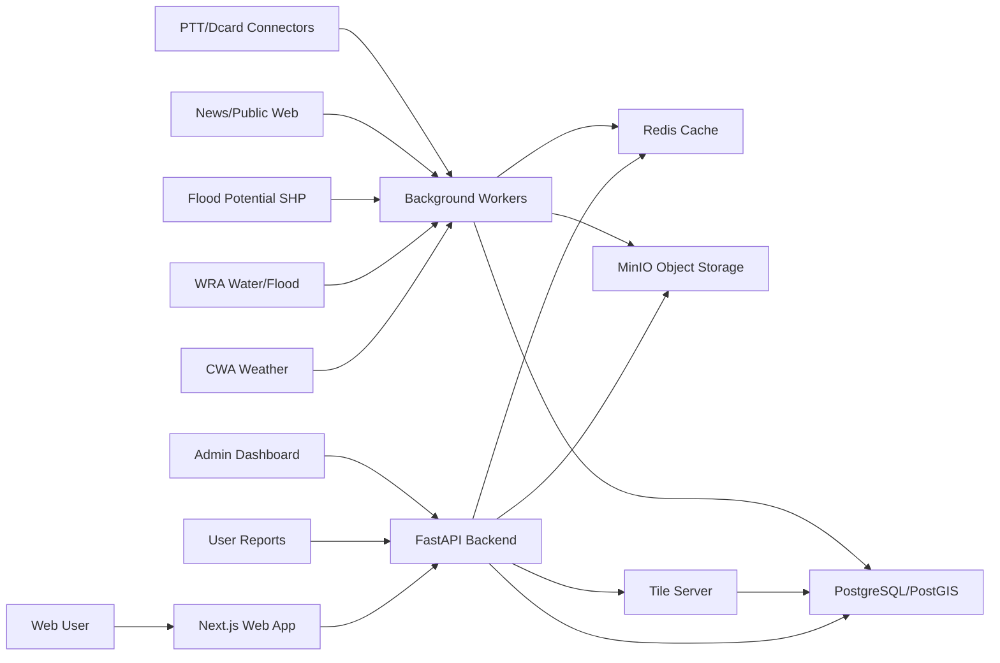

# 台灣淹水風險開放地圖 Project SDD

版本：0.1.0-draft  
狀態：討論稿  
最後更新：2026-04-28  
專案定位：公益、開源優先、可自架、可審計的台灣淹水風險查詢平台

---

## 0. SDD 使用規則

本專案以 SDD 作為唯一專案標準。此處的 SDD 定義為：

> Spec-first Software Design Document：先定義需求、邊界、資料契約、架構契約、測試契約與任務切分，再進入實作。

任何程式碼、資料管線、模型、UI、API、部署與測試都必須能追溯到本文件或後續 ADR。

### 0.1 文件權威順序

1. `docs/PROJECT_SDD.md`：專案最高設計契約。
2. `docs/adr/*.md`：架構決策紀錄，僅補充或修訂 SDD，不可暗中覆蓋。
3. `docs/api/*.yaml`：OpenAPI 與資料 schema 契約。
4. `docs/runbooks/*.md`：營運、除錯、資料修復流程。
5. 程式碼註解與 README：僅說明實作，不作為需求來源。

### 0.2 變更規則

所有影響以下項目的變更都必須先更新 SDD 或新增 ADR：

- 風險評分規則
- 資料來源與合法性假設
- API contract
- Database schema
- Background job contract
- Map layer contract
- Privacy/security policy
- Subagent work package boundary

### 0.3 Subagent 開發規則

後續若啟用 subagent 並行開發，每個 subagent 必須：

- 只負責一個明確 work package。
- 僅修改指定 ownership 範圍內的檔案。
- 不回滾其他 agent 或使用者的變更。
- 在 final 回報改了哪些檔案、跑了哪些測試、剩餘風險。
- 必須滿足該 work package 的 Definition of Done。

---

## 1. 專案願景

建立一個台灣公益型淹水風險開放地圖，讓民眾在購屋、租屋、通勤、災害應變前，可以用地址或地圖點選方式查詢指定地點的即時與歷史淹水風險。

本系統不宣稱取代政府警戒、不作為保險或法律鑑定依據，而是將分散於政府開放資料、地圖資料、新聞與公開討論中的線索整合成可追溯、可解釋、可質疑的風險參考。

### 1.1 核心主張

- 可信資料優先：官方資料是風險判斷基底。
- 開源優先：核心程式、資料管線、部署方式與模型邏輯盡量開源與可自架。
- 可解釋優先：每個風險分數必須能展開成證據。
- 隱私優先：不儲存不必要個資，不建立社群使用者画像。
- 可替換優先：所有外部資料來源都必須 adapter 化，避免被單一平台綁死。

---

## 2. 產品範圍

### 2.1 使用者故事

US-001：一般民眾可以輸入地址、地段、建案名或地標，查詢附近淹水風險。  
US-002：一般民眾可以直接點選地圖上的位置，查詢該點指定半徑內的淹水風險。  
US-003：使用者可以選擇 300m、500m、800m 或自訂搜尋半徑。  
US-004：使用者可以看到即時風險、歷史購屋參考風險與資料信心程度。  
US-005：使用者可以展開風險原因，看到資料來源、時間、距離、類型與可信度。  
US-006：使用者可以切換地圖圖層，例如淹水潛勢、雨量、水位、淹水警戒、歷史事件。  
US-007：系統可以統計某區域的查詢熱度，但查詢熱度不可直接等同於淹水風險。  
US-008：管理者可以查看資料擷取狀態、失敗任務、資料延遲與異常來源。  
US-009：研究者或公益組織可以下載去識別化、聚合後的風險摘要資料。

### 2.2 MVP 必做

- Taiwan map first screen
- Address/geocode search
- Map click search
- Radius query
- PostGIS spatial search
- Official weather/water/flood-potential adapters
- At least one non-official public evidence adapter from reviewed L2 sources, such as news, RSS, or public web APIs; PTT/Dcard/forum/social sources are Phase 4/V2 only and cannot satisfy MVP acceptance
- Risk score v0
- Evidence list
- Query popularity aggregation
- Basic admin/job health dashboard
- Docker Compose local deployment

### 2.3 明確不做

- 不以未授權方式大量爬取 Facebook、Instagram、Threads。
- 不儲存社群帳號個人檔案或建立個人行為資料庫。
- 不將單一社群貼文直接判定為淹水事實。
- 不提供法律、保險、估價或不動產投資保證。
- 不在第一版做手機 App，先做 responsive web。

---

## 3. 品質屬性

### 3.1 可維護性

- 所有資料來源透過 `DataSourceAdapter` interface 接入。
- 所有風險計算透過 pure domain service 執行，不依賴 web framework。
- UI components 不直接呼叫資料來源，只呼叫 backend API。
- Database migration 必須可重跑、可回滾、可在 CI 驗證。

### 3.2 可擴充性

- 新增資料來源不應修改風險模型核心，只新增 adapter 與 mapping。
- 新增地圖圖層不應修改查詢核心，只新增 layer metadata 與 tile/source endpoint。
- 新增評分因子必須透過 versioned scoring config。

### 3.3 效能

目標：

- 首頁互動可用時間：小於 2.5 秒。
- 單點風險查詢 P95：小於 1.5 秒，不含冷啟動外部擷取。
- 已快取查詢 P95：小於 500 ms。
- 地圖圖層 tile P95：小於 300 ms。
- 背景官方資料更新延遲：小於 10 分鐘，依來源更新頻率調整。

策略：

- 使用 PostGIS spatial index。
- 熱門查詢使用 Redis cache。
- 風險結果使用 deterministic cache key。
- 長時間資料擷取改由 background jobs 執行。
- 前端採 lazy layer loading，不一次載入所有圖層。

### 3.4 可靠性

- 單一資料來源失敗不可導致整體查詢失敗。
- 每筆 evidence 必須保留 ingestion status 與 source timestamp。
- API 回應必須標示資料新鮮度與缺漏來源。
- Background job 必須可重試、可追蹤、可重放。

### 3.5 隱私與安全

- 查詢紀錄預設聚合儲存，不保存精準個人身份。
- IP address 若需用於 abuse prevention，必須 hash + salt 並設定 TTL。
- 使用者回報資料需移除 EXIF GPS 以外不必要 metadata。
- 所有公開 evidence 顯示前需去識別化。
- Admin API 必須 authentication + role-based access control。

---

## 4. 開源與資料策略

### 4.1 開源優先原則

核心系統必須可在無商業 API 的情況下啟動：

- OpenStreetMap data
- MapLibre GL JS
- PostgreSQL/PostGIS
- FastAPI
- Redis
- Celery/RQ
- Scrapy/Playwright
- MinIO
- Prometheus/Grafana
- Docker Compose

### 4.2 可選非開源或政府 API adapter

以下 adapter 可存在，但不可成為不可替代核心：

- TGOS geocoding fallback
- 中央氣象署 API
- 水利署 API/KML/CSV/SHP
- Meta Content Library or official API

### 4.3 地圖策略

開發期：

- 可使用 OpenStreetMap public tiles。

正式公開：

- 優先自架 Taiwan OSM vector tiles。
- 使用 MapLibre GL JS 渲染。
- 圖磚資料以 Geofabrik Taiwan extract 或官方可用 OSM extract 建置。

### 4.4 地址定位策略

第一優先：

- 自架 Nominatim、Photon 或 Pelias。

第二優先：

- TGOS adapter fallback。

永遠可用：

- Map click query。

### 4.5 授權策略

Software license decision:

- Default project code license：`Apache-2.0`。
- Reason：Apache-2.0 is permissive like MIT, but includes an explicit patent grant and patent termination clause. It is better for long-lived public infrastructure and cross-organization collaboration.
- Use `Apache-2.0` for application code, infrastructure code, scripts, and internal packages unless a future ADR changes it.
- Alternative context：`MIT` is shorter and very permissive, but the project chooses Apache-2.0 for patent clarity.
- Avoid for this project by default：`AGPL` or `GPL`，除非未來明確希望強制所有網路服務修改都回饋原始碼。

### 4.6 資料輸出授權策略

資料必須分層授權，不可把所有資料混成同一種 license。

Layer A：Project-owned metadata and manually curated non-source-derived documentation

- Recommended license：`CC0-1.0`。
- Use when：我們自己產生且不含外部資料限制的欄位，例如分類標籤定義、公開 schema、測試用假資料。

Layer B：Project-generated derived risk summaries

- Recommended license：`CC BY 4.0` or `CC BY-SA 4.0` after legal review。
- Use when：資料來自多個來源聚合後的風險等級、行政區級統計、H3 聚合桶。
- Must include：來源聲明、模型版本、資料時間範圍、限制說明。

Layer C：Data derived from OpenStreetMap

- Must comply with OSM `ODbL` attribution and share-alike requirements when applicable。
- Never relicense OSM-derived database as pure CC0。

Layer D：Taiwan government open data

- Must preserve source attribution according to `政府資料開放授權條款－第1版` or dataset-specific terms。
- Derived products must list source agencies and retrieval dates.

Layer E：News/forum/social evidence

- Do not redistribute full text by default。
- Store and expose source URL, timestamp, source type, short summary, location inference, and confidence only.
- Full text caching is allowed only when license/terms permit or for temporary internal processing under retention limits.

Layered licensing decision:

- Public export v1 will expose aggregated risk summaries, not raw scraped posts.
- Public export v1 will include attribution manifest and score version.
- The project must not publish a combined dataset under a single license if its source layers have different obligations.

### 4.7 社群與非官方佐證策略

User decision:

- MVP must not rely only on official data.
- Non-official public evidence is required because public reports and discussions can be closer to real on-the-ground conditions.

Implementation rule:

- MVP must include official evidence plus at least one non-official evidence family.
- Priority order：news/RSS/public web, PTT, Dcard, then authorized Meta-related sources.
- Facebook, Instagram, and Threads require official API, Meta Content Library, research access, explicit permission, or a later ADR. Unauthenticated anti-bot bypass is not allowed.

---

## 5. 系統總體架構

### 5.1 High-level architecture



### 5.2 Runtime services

- `web`：Next.js frontend。
- `api`：FastAPI REST API。
- `worker`：background ingestion and scoring jobs。
- `scheduler`：periodic job trigger。
- `db`：PostgreSQL + PostGIS。
- `redis`：cache, queue broker, rate limits。
- `tile-server`：vector/raster tile service。
- `object-storage`：raw source snapshots, user-uploaded evidence media。
- `observability`：Prometheus, Grafana, structured logs。

---

## 6. 建議 Monorepo 結構

```text
flood-risk/
  apps/
    web/
      app/
      components/
        map/
      features/
        map/
        search/
        risk/
        evidence/
        admin/
      lib/
      styles/
      tests/
    api/
      app/
        main.py
        api/
          routes/
          dependencies/
        domain/
          risk/
          evidence/
          geospatial/
          scoring/
        infrastructure/
          db/
          cache/
          object_storage/
          external/
        schemas/
        services/
      tests/
    workers/
      app/
        jobs/
        adapters/
          cwa/
          wra/
          flood_potential/
          news/
          ptt/
          dcard/
          user_report/
        pipelines/
        classifiers/
      tests/
  packages/
    contracts/
      openapi/
      jsonschema/
      fixtures/
    geo/
      styles/
      tile-config/
    shared/
      risk-rules/
      keywords/
  data/
    raw/
    processed/
    samples/
  infra/
    docker/
    migrations/
    scripts/
    monitoring/
  docs/
    PROJECT_SDD.md
    adr/
    api/
    data-sources/
    runbooks/
    testing/
```

### 6.1 模組依賴方向

Allowed:

- `api -> domain`
- `api -> infrastructure`
- `workers -> domain`
- `workers -> infrastructure`
- `web -> API contracts`
- `domain -> shared config`

Forbidden:

- `domain -> FastAPI`
- `domain -> database driver`
- `domain -> crawler implementation`
- `web -> database`
- `web -> external data source directly`
- `risk scoring -> UI state`

---

## 7. Domain Model

### 7.1 Core entities

`LocationQuery`

- `id`
- `input_type`: address | map_click | parcel | landmark
- `raw_input`
- `point`: geometry(Point, 4326)
- `radius_m`
- `created_at`
- `privacy_bucket`

`Place`

- `id`
- `name`
- `type`
- `point`
- `admin_code`
- `source`
- `confidence`

`Evidence`

- `id`
- `source_id`
- `source_type`: official | news | forum | social | user_report | derived
- `event_type`: rainfall | water_level | flood_warning | flood_potential | flood_report | road_closure | discussion
- `title`
- `summary`
- `url`
- `occurred_at`
- `observed_at`
- `ingested_at`
- `point`
- `geometry`
- `distance_to_query_m`
- `confidence`
- `freshness_score`
- `source_weight`
- `privacy_level`
- `raw_ref`

`RiskAssessment`

- `id`
- `query_id`
- `score_version`
- `realtime_score`
- `historical_score`
- `confidence_score`
- `risk_level_realtime`: low | medium | high | severe | unknown
- `risk_level_historical`: low | medium | high | severe | unknown
- `explanation`
- `evidence_ids`
- `created_at`
- `expires_at`

`DataSource`

- `id`
- `name`
- `adapter_key`
- `license`
- `update_frequency`
- `last_success_at`
- `last_failure_at`
- `health_status`
- `legal_basis`

`QueryHeatBucket`

- `id`
- `h3_index`
- `period`
- `query_count`
- `unique_approx_count`
- `updated_at`

### 7.2 Spatial indexing

- Use PostGIS geometry/geography for exact radius search.
- Use H3 or geohash for heat aggregation and cache keys.
- Store all source coordinates in WGS84 EPSG:4326.
- Convert source SHP/TWD97 when ingesting, never at query time.

---

## 8. Data Source Adapter Contract

所有資料來源必須實作同一個 adapter contract。

```python
class DataSourceAdapter:
    key: str
    source_type: SourceType

    async def fetch(self, window: TimeWindow, area: Area | None) -> RawBatch:
        ...

    async def normalize(self, raw: RawBatch) -> list[NormalizedEvidence]:
        ...

    async def validate(self, items: list[NormalizedEvidence]) -> ValidationReport:
        ...
```

### 8.1 Adapter rules

- Adapter 不直接寫入正式 evidence table。
- Adapter 先寫 raw snapshot，再寫 staging table。
- Pipeline 驗證通過後才 promote。
- 每個 adapter 必須有 sample fixture 與 parser tests。
- 外部網站失敗必須回報 structured error，不可吞掉。

### 8.2 資料合法性等級

L1：官方開放資料，可穩定使用。  
L2：公開網站/RSS/API，需遵守 robots、頻率與引用規則。  
L3：公開論壇，需低頻、去識別化、可關閉。  
L4：需授權平台資料，例如 Meta Content Library。  
L5：不使用，包含需要規避登入、驗證、反爬或違反條款的資料取得方式。

第一版只允許 L1、L2。V2 可加入經審核的 L3。L4 必須透過 ADR 才可啟用。L5 永遠不納入。

---

## 9. Risk Scoring Design

### 9.1 雙分數模型

`realtime_score`：即時淹水風險。  
`historical_score`：歷史購屋參考風險。  
`confidence_score`：資料信心程度。

### 9.1.1 Public risk levels

User-facing risk levels:

- `低`
- `中`
- `高`
- `極高`
- `未知`

Internal numeric scores may exist for calculation, regression tests, and threshold tuning, but the primary public UI must present risk as levels rather than asking users to interpret raw numbers.

### 9.2 Realtime scoring factors

- Current rainfall intensity
- Rainfall accumulation over 1h, 3h, 6h, 24h
- Heavy rain warning
- Typhoon warning
- Water level near warning threshold
- Flood warning layer intersection
- Recent verified flood reports
- Road closure or emergency reports
- Source freshness

### 9.3 Historical scoring factors

- Flood potential depth/category at location
- Historical official disaster/flood record
- Repeated news evidence
- Repeated public discussion evidence
- Low-lying terrain or proximity to rivers/drainage, if data available
- Evidence density within radius
- Recency decay

### 9.4 Query heat rule

Query heat is not risk.

查詢熱度只能顯示為：

- public concern
- recent attention
- community interest

不可直接提高 `realtime_score` 或 `historical_score`。若未來要讓 query heat 影響模型，必須新增 ADR，並設計防操縱機制。

### 9.5 Score versioning

每次風險模型更新都必須：

- 新增 `score_version`
- 保留舊版評分結果可追溯
- 提供 migration/backfill job
- 更新 fixture expected outputs

### 9.6 Explanation contract

API 必須回傳人類可讀 explanation：

```json
{
  "summary": "歷史風險中高，目前即時風險低。",
  "main_reasons": [
    "此位置落在淹水潛勢範圍內。",
    "過去兩年半徑 500 公尺內有多筆公開新聞提及積淹水。",
    "目前附近雨量站未達豪雨警戒。"
  ],
  "missing_sources": [
    "部分水位資料暫時無法更新"
  ]
}
```

### 9.7 AI/NLP policy

Decision:

- V1 uses rules plus small open-source NLP models.
- V1 does not use LLMs as a required runtime dependency.
- Any later LLM use requires ADR and cost/privacy review.

AI/NLP may be used as an assistive classifier, not as the sole source of truth.

Allowed v1 NLP tasks:

- Flood keyword classification
- Location mention extraction
- Duplicate or near-duplicate detection
- Evidence relevance scoring
- Short summary generation for internal review or public display with source link

Not allowed in v1:

- Generating unsupported flood claims
- Inventing locations or event times
- Replacing source evidence with model output
- Using private or non-permitted social data for model training

Audit requirements:

- Every AI/NLP output must keep source evidence IDs.
- Every model or rule set must have a version.
- Golden fixtures must include false positive and false negative examples.
- The UI must not present AI-generated summaries as official facts.

---

## 10. API Contract Draft

### 10.1 Public APIs

`GET /health`

- Service health.

`POST /v1/geocode`

- Input address/landmark.
- Output candidate points with confidence.

`POST /v1/risk/assess`

Request:

```json
{
  "point": { "lat": 25.033, "lng": 121.5654 },
  "radius_m": 500,
  "time_context": "now"
}
```

Response:

```json
{
  "assessment_id": "uuid",
  "location": { "lat": 25.033, "lng": 121.5654 },
  "radius_m": 500,
  "realtime": {
    "level": "低"
  },
  "historical": {
    "level": "高"
  },
  "confidence": {
    "level": "中"
  },
  "explanation": {},
  "evidence": [],
  "data_freshness": [],
  "query_heat": {}
}
```

`GET /v1/evidence/{assessment_id}`

- Paginated evidence list.

`GET /v1/layers`

- Available map layers and metadata.

`GET /v1/layers/{layer_id}/tilejson`

- TileJSON endpoint for MapLibre.

`POST /v1/user-reports`

- Optional later version.

### 10.2 Admin APIs

`GET /admin/v1/jobs`

- Job status.

`POST /admin/v1/jobs/{job_key}/run`

- Trigger job manually.

`GET /admin/v1/sources`

- Source health and data freshness.

---

## 11. Database Design Draft

### 11.1 Tables

- `data_sources`
- `raw_snapshots`
- `staging_evidence`
- `evidence`
- `location_queries`
- `risk_assessments`
- `risk_assessment_evidence`
- `query_heat_buckets`
- `map_layers`
- `ingestion_jobs`
- `adapter_runs`
- `user_reports`
- `audit_logs`

### 11.2 Required indexes

- `evidence.geom GIST`
- `evidence.occurred_at BTREE`
- `evidence.source_type BTREE`
- `risk_assessments.query_id BTREE`
- `location_queries.geom GIST`
- `query_heat_buckets.h3_index BTREE`
- `adapter_runs.adapter_key, started_at BTREE`

### 11.3 Data retention

- Raw official snapshots：保留 180 天，重要版本可永久封存。
- Raw web/news snapshots：保留 30-90 天，依授權與必要性調整。
- User reports：預設保存去識別化結果，原始圖片可設定 TTL。
- Query logs：精準查詢點不長期保存，只保留 H3 聚合桶。

---

## 12. Frontend Design System

### 12.1 First screen

第一屏必須是可操作地圖，不做 landing page。

Primary UI:

- Search input
- Radius selector
- Map click marker
- Risk summary panel
- Layer control
- Evidence drawer
- Data freshness indicator

### 12.2 Visual rules

- 地圖為主要畫面。
- 風險顏色需符合可讀性，不只依賴顏色，需搭配文字/符號。
- 移動版必須可單手操作搜尋與風險面板。
- Evidence drawer 需能清楚分辨官方、新聞、論壇、使用者回報。
- 不使用誇張恐嚇式文案。

### 12.3 Frontend states

- Empty
- Searching
- Geocode candidates
- Assessing
- Partial data
- Success
- No evidence found
- Source degraded
- Error

---

## 13. Background Job Design

### 13.1 Job types

- `ingest.cwa.rainfall`
- `ingest.cwa.warnings`
- `ingest.wra.water_level`
- `ingest.wra.flood_warning`
- `ingest.flood_potential.import`
- `ingest.news.search`
- `ingest.forum.ptt`
- `ingest.forum.dcard`
- `score.backfill`
- `tiles.refresh`
- `maintenance.cleanup`

### 13.2 Job contract

Each job must report:

- `job_key`
- `adapter_key`
- `started_at`
- `finished_at`
- `status`
- `items_fetched`
- `items_promoted`
- `items_rejected`
- `error_code`
- `error_message`
- `source_timestamp_min`
- `source_timestamp_max`

### 13.3 Retry policy

- Network transient errors：exponential backoff。
- Parser errors：do not retry infinitely; quarantine snapshot。
- Schema mismatch：fail fast and alert。
- Legal/permission error：disable source until reviewed。

---

## 14. Testing Strategy

### 14.1 Test pyramid

- Unit tests：domain scoring, parsers, geospatial helpers。
- Contract tests：API response schema, adapter normalized schema。
- Integration tests：PostGIS queries, Redis cache, worker pipeline。
- E2E tests：map search, radius query, layer toggle, evidence drawer。
- Data regression tests：sample source fixtures to normalized evidence。
- Performance tests：risk query P95 and tile response time。

### 14.2 Required CI gates

Before merge:

- Lint frontend
- Typecheck frontend
- Unit tests frontend
- Lint backend
- Typecheck backend
- Unit tests backend
- Migration check
- Contract tests

Before release:

- Integration tests
- E2E browser tests
- Seeded local environment smoke test
- Performance smoke test
- Data source health check

### 14.3 Golden fixtures

Maintain fixtures for:

- Heavy rainfall near a queried point
- Flood potential intersects query radius
- No evidence found
- Partial source outage
- Conflicting evidence
- Historical high risk but realtime low risk
- Realtime high risk but historical unknown

---

## 15. Observability

### 15.1 Logs

Use structured JSON logs with:

- `request_id`
- `assessment_id`
- `job_id`
- `adapter_key`
- `source_id`
- `duration_ms`
- `error_code`

### 15.2 Metrics

- API latency P50/P95/P99
- Risk assessment count
- Cache hit ratio
- Adapter success/failure count
- Source data freshness
- Evidence promotion/rejection count
- Tile latency
- Worker queue depth

### 15.3 Alerts

- 官方資料超過預期時間未更新。
- Risk API P95 超過目標。
- Adapter parser error spike。
- Database disk usage high。
- Tile server error rate high。

---

## 16. Security and Privacy

### 16.1 Threat model

Risks:

- 查詢熱度被灌水。
- 使用者回報假資料。
- 社群資料含個資。
- External source poisoning。
- Admin API 被濫用。
- 地圖查詢被大量爬取造成服務耗盡。

Controls:

- Rate limit by privacy-preserving bucket。
- User report moderation and evidence weighting。
- PII minimization。
- Source allowlist。
- Admin auth and audit logs。
- Cache and quota controls。

### 16.2 Public data display policy

Evidence display must prefer:

- Source name
- Published time
- Approximate location
- Summary
- Link

Avoid:

- Username
- Profile image
- Personal contact info
- Full copied post content when unnecessary

---

## 17. Deployment Plan

### 17.1 Local development

Required command target:

```text
docker compose up
```

Should start:

- web
- api
- worker
- scheduler
- postgres/postgis
- redis
- minio
- tile-server, optional in phase 1

### 17.2 Environments

- `local`
- `staging`
- `production`

### 17.3 Release strategy

- Main branch always deployable.
- Feature branches via PR.
- Database migrations run before app rollout.
- Risk scoring version changes require staged backfill.
- Data source adapters can be disabled by config without redeploying core API.

### 17.4 Low-cost production strategy

Primary cost goal:

- Minimize monthly fixed cost while keeping the architecture self-hostable and portable.

Stage A：Pilot / private beta

- One Zeabur-hosted VPS.
- Run `web`, `api`, `worker`, `scheduler`, `PostGIS`, `Redis`, and reverse proxy on one machine.
- Do not self-host full production map tile infrastructure yet.
- Use cached OSM-compatible tiles or a lightweight Taiwan-only tile setup if traffic is low.

Primary deployment path:

- Create a GitHub repository for this project.
- Connect the repository to Zeabur.
- Zeabur deploys from the GitHub repository.
- Local development changes are delivered through `git commit` and `git push`.
- Zeabur pulls the latest repository changes and redeploys automatically.

Deployment contract:

- The repository must include all build and runtime configuration needed by Zeabur.
- Required environment variables must be documented in `.env.example` and `docs/runbooks/deploy-zeabur.md`.
- Database migrations must run deterministically during deploy or as an explicit release step.
- Background workers and scheduled jobs must be represented as explicit services, not hidden inside the web process.
- The app must remain portable to a generic Docker Compose VPS if Zeabur deployment constraints change.

Stage B：Public beta

- Split database from app only when needed.
- Add object storage for raw snapshots and backups.
- Add monitoring.
- Keep tile server separate if map traffic grows.

Stage C：Public production

- Separate app server, database server, tile server, and backup storage.
- Add CDN only for static web assets and tiles if cost allows.

Fallback low-cost providers to evaluate only if Zeabur becomes unsuitable:

- Oracle Cloud Always Free：lowest direct cost, generous free ARM compute, but capacity/account reliability must be tested.
- Hetzner Cloud：strong price/performance, especially for self-hosted OSS stacks, but Taiwan latency may be higher depending on region.
- DigitalOcean/Vultr/Linode：usually simpler operations and Asia regions may reduce latency, but monthly cost is higher.
- Fly.io：good global edge deployment, but persistent PostGIS and bandwidth can become less predictable for this workload.

Working decision:

- Start with local Docker Compose.
- Use GitHub as the source of deployment truth.
- Use Zeabur VPS as staging/production beta target.
- Keep Docker Compose compatibility for local development and future migration.

---

## 18. Development Phases

### Phase 0：SDD and Contracts

Goal:

- 完成本文件、ADR skeleton、OpenAPI draft、DB schema draft。

Deliverables:

- `docs/PROJECT_SDD.md`
- `docs/adr/0001-sdd-as-source-of-truth.md`
- `docs/api/openapi.yaml`
- Initial issue/work package list

### Phase 1：Map and Core Query MVP

Goal:

- 使用者可查位置，後端可回傳 mock risk assessment。

Deliverables:

- Next.js map UI
- FastAPI base service
- PostGIS schema
- Geocode adapter interface
- Risk API contract
- E2E smoke test

### Phase 2：Official and Public Evidence Ingestion

Goal:

- 接入官方氣象、水利、淹水潛勢資料，並接入至少一個非官方公開佐證來源。

Deliverables:

- CWA rainfall/warning adapter
- WRA water/flood adapter
- Flood potential import pipeline
- News/public web adapter from reviewed L2 public sources; forum adapters are Phase 4/V2 only and cannot satisfy Phase 2 acceptance
- Evidence normalization
- Data freshness dashboard

### Phase 3：Risk Scoring v0

Goal:

- 根據官方資料與 L2 公開佐證產生可解釋即時/歷史風險；購屋情境不得以「目前即時雨量/水位正常」推論多年歷史風險低。

Deliverables:

- Scoring engine
- Explanation builder
- Golden fixtures
- API integration
- UI risk panel

### Phase 4：Expanded News and Public Discussion

Goal:

- 擴充新聞與可合法公開論壇訊號，提升覆蓋率、去重與文字分類品質。

Deliverables:

- News adapter
- PTT/Dcard optional adapters
- Text classifier v0
- Deduplication
- Source weighting

### Phase 5：Public Reports and Governance

Goal:

- 使用者可匿名回報現場淹水，並有審核與濫用控制。

Deliverables:

- User report API
- Upload pipeline
- Moderation dashboard
- Privacy controls

### Phase 6：Production Hardening

Goal:

- 自架圖磚、監控、備份、壓測、正式公開。

Deliverables:

- Tile pipeline
- Monitoring
- Backup/restore
- Load test
- Security review
- Public documentation

---

## 19. Subagent Work Package Matrix

以下設計是為了讓後續可並行啟用 subagent。每個 work package 都有獨立 ownership，降低衝突。

### WP-001 SDD/ADR/Contracts

Ownership:

- `docs/`
- `packages/contracts/`

Responsibilities:

- Maintain SDD
- ADR templates
- OpenAPI schema
- JSON schema fixtures

Definition of Done:

- SDD has version and status.
- OpenAPI validates.
- Contract examples match test fixtures.

### WP-002 Frontend Map Shell

Ownership:

- `apps/web/app/`
- `apps/web/components/map/`
- `apps/web/features/map/`

Responsibilities:

- MapLibre/Leaflet shell
- Marker placement
- Radius visualization
- Layer control

Definition of Done:

- Desktop and mobile map render.
- Map click emits point.
- Radius circle stable across zoom.
- Playwright screenshot nonblank.

### WP-003 Frontend Search and Risk UI

Ownership:

- `apps/web/app/`
- `apps/web/features/search/`
- `apps/web/features/risk/`
- `apps/web/features/evidence/`

Responsibilities:

- Address search
- Geocode candidate UI
- Risk summary panel
- Evidence drawer

Definition of Done:

- Handles loading/error/partial states.
- No text overflow on mobile.
- Risk explanation readable.

### WP-004 Backend API Core

Ownership:

- `apps/api/app/api/`
- `apps/api/app/schemas/`
- `apps/api/app/main.py`

Responsibilities:

- FastAPI app
- Public routes
- Error handling
- OpenAPI alignment

Definition of Done:

- API health works.
- Contract tests pass.
- Errors are structured.

### WP-005 Domain Risk Engine

Ownership:

- `apps/api/app/domain/risk/`
- `apps/api/app/domain/scoring/`
- `packages/shared/risk-rules/`

Responsibilities:

- Realtime scoring
- Historical scoring
- Confidence scoring
- Explanation builder

Definition of Done:

- Pure unit tests.
- Golden fixture outputs stable.
- Score version recorded.

### WP-006 Geospatial and Database

Ownership:

- `apps/api/app/infrastructure/db/`
- `infra/migrations/`
- `packages/geo/`

Responsibilities:

- PostGIS schema
- Spatial indexes
- Query helpers
- Migration tooling

Definition of Done:

- Migrations apply from empty DB.
- Radius query returns correct fixtures.
- Indexes verified.

### WP-007 Worker Framework

Ownership:

- `apps/workers/app/jobs/`
- `apps/workers/app/pipelines/`

Responsibilities:

- Worker runtime
- Scheduler
- Job status model
- Retry/quarantine

Definition of Done:

- Sample job runs locally.
- Failed job captured.
- Job metrics emitted.

### WP-008 Official Data Adapters

Ownership:

- `apps/workers/app/adapters/cwa/`
- `apps/workers/app/adapters/wra/`
- `apps/workers/app/adapters/flood_potential/`
- `docs/data-sources/official/`

Responsibilities:

- CWA ingestion
- WRA ingestion
- Flood potential import
- Normalized evidence mapping

Definition of Done:

- Fixture parser tests.
- Source metadata documented.
- Adapter can be disabled by config.

### WP-009 News/Public Web Adapters

Ownership:

- `apps/workers/app/adapters/news/`
- `apps/workers/app/classifiers/`
- `docs/data-sources/news/`

Responsibilities:

- News source ingestion
- Keyword and location extraction
- Deduplication

Definition of Done:

- Legal basis documented.
- Fixture tests pass.
- Dedup handles repeated articles.

### WP-010 Forum Adapters

Ownership:

- `apps/workers/app/adapters/ptt/`
- `apps/workers/app/adapters/dcard/`
- `docs/data-sources/forums/`

Responsibilities:

- Optional forum ingestion
- Rate limiting
- Privacy-preserving summaries

Definition of Done:

- Adapter default disabled.
- Terms/legal review note exists.
- No username stored by default.

### WP-011 Tile and Layer Pipeline

Ownership:

- `packages/geo/tile-config/`
- `packages/geo/styles/`
- `infra/docker/tile-server/`

Responsibilities:

- OSM tiles
- Layer metadata
- TileJSON endpoints
- Map styles

Definition of Done:

- Local map can render Taiwan.
- Attribution visible.
- Tile server documented.

### WP-012 Observability and Ops

Ownership:

- `infra/monitoring/`
- `docs/runbooks/`

Responsibilities:

- Metrics
- Dashboards
- Alerts
- Runbooks

Definition of Done:

- API and worker metrics visible.
- At least 3 runbooks exist.
- Source freshness alert defined.

### WP-013 Security and Privacy

Ownership:

- `apps/api/app/security/`
- `docs/security/`
- `docs/privacy/`

Responsibilities:

- Rate limit
- Admin auth
- Audit logs
- Privacy policy implementation notes

Definition of Done:

- Admin endpoints protected.
- Query logs aggregated.
- PII minimization tests or checks exist.

### WP-014 Testing and CI

Ownership:

- `.github/workflows/`
- `docs/testing/`
- test setup files across apps

Responsibilities:

- CI pipeline
- Test fixtures
- E2E setup
- Performance smoke test

Definition of Done:

- CI runs lint/typecheck/unit.
- Integration test target documented.
- E2E smoke test can run locally.

---

## 20. Integration Protocol

### 20.1 Branch strategy

- Branch prefix：`codex/`
- One work package per branch when possible.
- Integration branch：`codex/integration-sdd-mvp`

### 20.2 Merge rules

Before merging a subagent branch:

- Confirm changed files are within ownership.
- Run package-specific tests.
- Run contract tests if API/schema changed.
- Update SDD/ADR if architecture changed.
- Confirm no unrelated formatting churn.

### 20.3 Conflict resolution

Priority:

1. Preserve SDD contract.
2. Preserve public API compatibility.
3. Preserve database migration order.
4. Preserve user-facing behavior.
5. Refactor only within ownership unless coordinated.

---

## 21. Refactoring Rules

Refactoring is allowed when:

- It reduces duplication across three or more places.
- It isolates external source details behind an adapter.
- It improves testability of domain logic.
- It removes framework dependency from domain.
- It improves performance with measurable evidence.

Refactoring requires ADR when:

- It changes module boundaries.
- It changes scoring output.
- It changes API response structure.
- It changes database schema meaning.
- It changes data retention or privacy behavior.

---

## 22. Acceptance Criteria for MVP

MVP is accepted when:

- User can open web app and see Taiwan map.
- User can search address or click map.
- User can choose radius.
- System returns realtime risk, historical risk and confidence.
- Risk result includes explanation and evidence list.
- At least two official data source families are ingested.
- Flood potential layer can be displayed.
- Query heat is aggregated and shown separately from risk.
- Source freshness is visible.
- Local `docker compose up` can start core services.
- CI validates lint, typecheck and unit tests.
- Documentation explains limitations and non-guarantee.

---

## 23. Open Questions

Resolved decisions:

OQ-001：第一個試點區域  
Decision：全台灣。

OQ-002：地址定位是否允許 TGOS fallback  
Decision：允許。自架 geocoder 優先，TGOS 作為 fallback adapter。

OQ-003：第一版是否接受只使用官方資料，不加入社群  
Decision：不接受。MVP 必須包含至少一個非官方公開佐證來源。

OQ-004：風險顯示偏好  
Decision：使用 `低`、`中`、`高`、`極高`。內部可保留數值分數，但公開 UI 以等級為主。

OQ-005：使用者回報是否放入 MVP  
Decision：延到 Phase 5。

OQ-006：專案授權  
Decision：`Apache-2.0` for software。它不是最短的 license，但在寬鬆授權中比 MIT 更適合長期公共基礎設施，因為有明確專利授權。

OQ-007：資料輸出授權  
Decision：分層授權。自有 metadata/schema/test fixtures 用 `CC0-1.0`；聚合後風險資料用 `CC BY 4.0` 或 `CC BY-SA 4.0`；OSM 衍生資料遵守 `ODbL`；政府資料遵守 `政府資料開放授權條款－第1版`；新聞/社群只輸出摘要與連結，不再散布全文。

OQ-008：語系  
Decision：只需要繁體中文。

OQ-009：正式環境預算與主機位置  
Decision：使用 Zeabur VPS 作為 staging/production beta 部署目標。建立 GitHub repo 後連接 Zeabur；本地開發透過 commit/push 觸發 Zeabur 自動重新部署。保留 Docker Compose portability，以便未來遷移。

OQ-010：是否接受 AI/NLP 模型輔助分類  
Decision：第一版使用規則 + 小型開源 NLP 模型。僅作輔助分類、摘要、地名抽取、去重與相關性排序；不可讓 AI/NLP 成為唯一事實來源。所有模型輸出都必須保留 evidence ID、模型版本與可測 fixture。

---

## 24. Initial ADR List

- ADR-0001：SDD as source of truth
- ADR-0002：MapLibre + self-hosted OSM tiles
- ADR-0003：FastAPI + PostGIS backend
- ADR-0004：Adapter-based data ingestion
- ADR-0005：Dual risk score model
- ADR-0006：Privacy-preserving query heat
- ADR-0007：Official data before social scraping
- ADR-0008：Score versioning and explainability

---

## 25. Immediate Next Actions

Recommended next sequence:

1. 建立 ADR skeleton。
2. 建立 OpenAPI draft。
3. 建立 monorepo skeleton。
4. 建立 Docker Compose base。
5. 建立 mock risk API。
6. 建立 map-first frontend shell。
7. 接第一批官方資料 adapter。
8. 接第一個非官方公開佐證 adapter。

---

## 26. Design Principle Summary

本專案不追求一開始就抓到最多資料，而是追求：

- 最可信的資料基底。
- 最清楚的資料契約。
- 最容易替換的資料來源。
- 最可測試的風險模型。
- 最能被公眾理解的風險解釋。
- 最能被 subagent 並行開發而不互相踩踏的模組邊界。

此 SDD 是後續專案開發、測試、除錯、重構與整合的唯一出發點。
